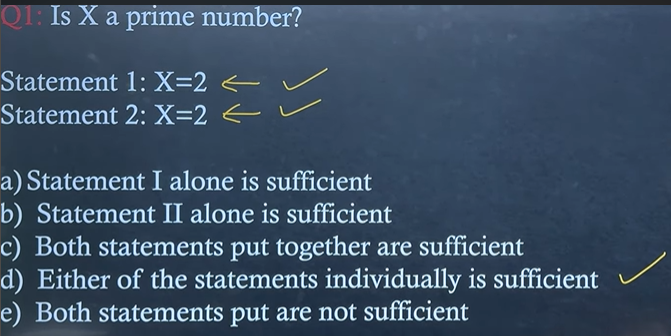
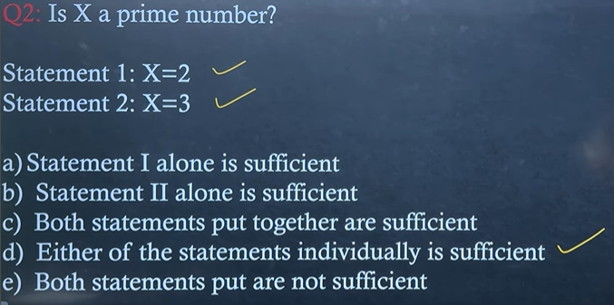
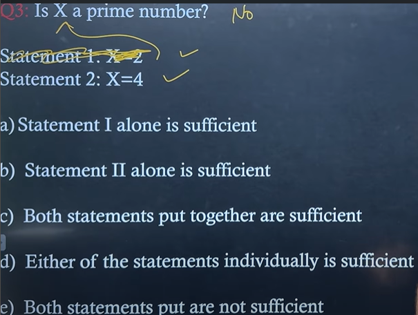
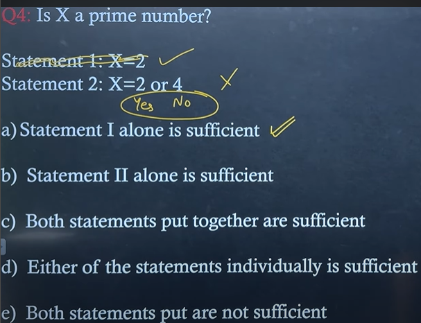
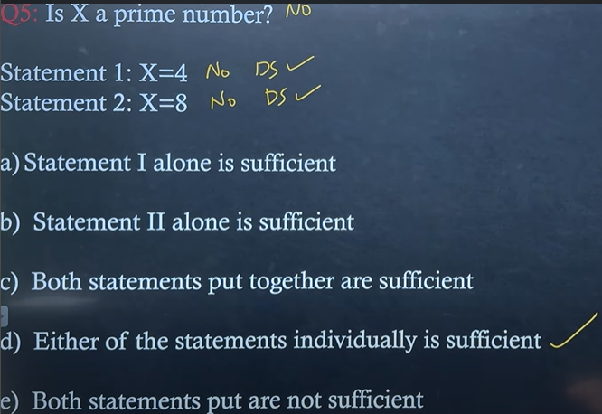
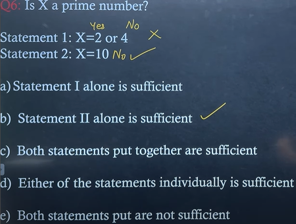
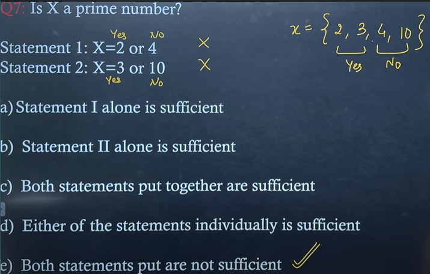
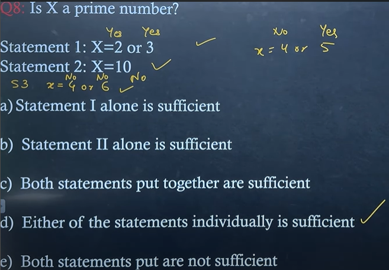
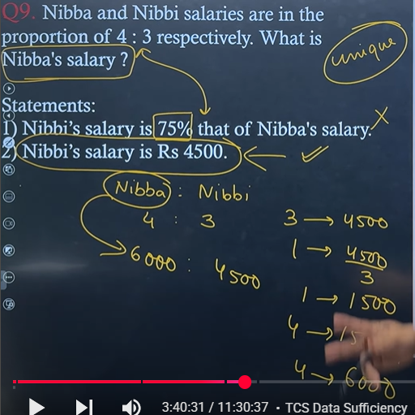

<p style="font-size:2rem"><span style="color:red">Most imp advice</span>
<span style="color:yellow">cross check jarur karna</span> </p>

> We are looking for **unique solution**

> if Answer **Yes/No** then **data is sufficient**

* We want clarity, it is not about that is statement giving answer **yes** for question statement, **answer no bhi aa sakta hai** phir bhi data is sufficient

> It is about whether the **given statement are telling sufficiently** about the given que statement

* While watching statement 1 ignore the statement 2
* And While watching statement 2 ignore the statement 1

<p style="font-size:2rem"><span style="color:yellow">We want ek toh <strong>yes ya no</strong> for que statement,</span> <span style="color:red">Latka ke nahi rakhna hai</span></p>

> **Yes** ya **No** mein se answer de pa raha hu, then data is **sufficinet**


> **search question type**
> 1) YES/NO
> 2) Value based

# <p style="color:magenta">We have to check first <br> </p>
<p style="color:pink"> 1) Yes or No, if answerable then sufficient
if the one of the two or both are not sufficient to answer  <br>
2) then merge both of them
</p>

****

# Q) 

**ans d**
yaha dono mein se koi bhi ek statement is telling clearly that they are sufficient to answer the que statement

<br>


**ans d**
yaha bhi, dono mein se koi bhi ek statement is telling clearly that we are sufficient to answer the que statement

<br>


**ans d**
why because, one statement is saying yes, i am prime, other telling no i am not, but it is getting clear that, these answer are sufficient for que statement

> if the **statement are giving clear answer** to the que statement that is **Yes** or **No**, then they are **sufficient**

<br>


**ans a**
because statement 2 mein **conflict** ho gaya, yes and no dono sath mein aa gaye
> if **ek hi statement mein yes and no sath mein**, then data **insufficient**

<br>


**ans d**
yaha bhale hi **ans no hai**, but they are **telling sufficiently**, that we are no, thats why ans  d

<br>


**ans b**
yaha **conflict aa gaya, isiliye statement 1 is insufficient**, but **statement 2 is telling clearly thats why sufficinet**

<br>


**ans e**
here, 
* statement 1 is having conflict -> insufficient
* statement 2 is having conflict -> insufficient

> then **combine** them for checking ans c
```java
if(they in combine give sufficiency){
    ans c
}
else{
    and e
} 
```

<br>


yaha yes, yes no conflict sufficient

****

# Actual Questions
## Unique value wala que

yaha 
* statement one koi **unique value nahi de pa raha tha**, matlab 75% but of what, 2000 ka 75%, 3000 ka, 59000 ka? kitne value ka? **insufficient**
* but **statement 2 is giving unique value**, thats why it is **sufficient**
#### ans **II alone is sufficient while I alone is not sufficient**