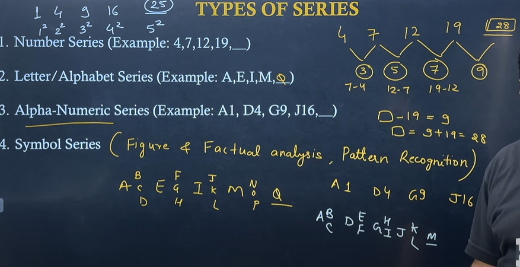
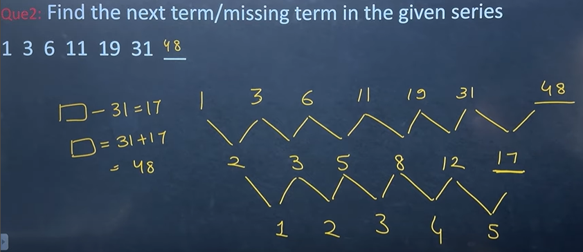

# Types of Series Question

# Categories of Questions

# All possible series
## 1. Difference

- **just take difference** of the numbers, we get to see some series in it

## 2. Double Difference

- **just take difference of difference** of the numbers, we get to see some series in it
3. Square
4. Cube
5. Prime
6. Multip1es
7. Factors
8. Series with combinations
9. Miscellenous