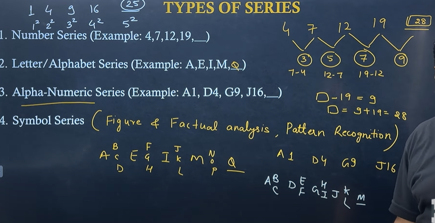
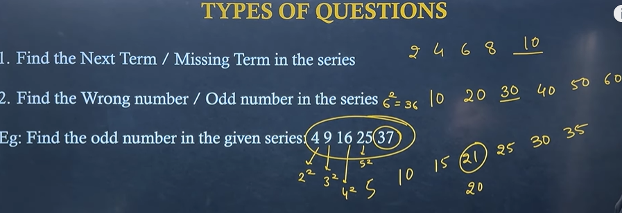
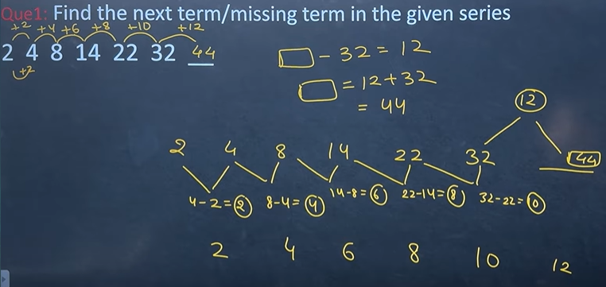
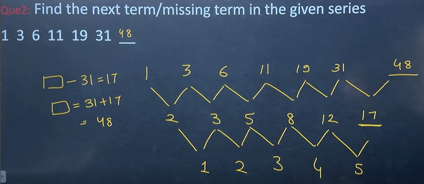
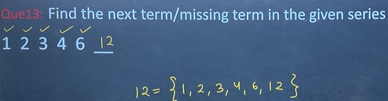
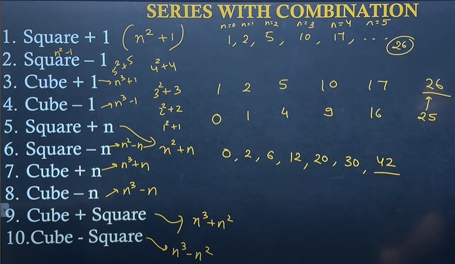
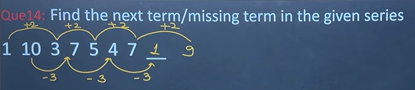
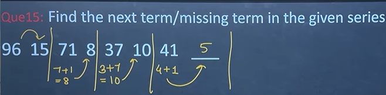

# Types of Series Question

# Categories of Questions

****

# All possible series
## 1. Difference

- **just take difference** of the numbers, we get to see some series in it

****

## 2. Double Difference

- **just take difference of difference** of the numbers, we get to see some series in it
  
****

## 3. Square
- watch for **squares**
  - whether they are squares
  - or difference is square
  - multiply by square

****

## 4. Cube
- watch for **cubes**
  - whether they are cubes
  - or difference is cubes
  - multiply by cubes

****

## 5. Prime
- watch for **primes**
  - whether they are primes
  - or difference is primes
  - multiply by primes

## 6. Multiples
- watch for multiples
  - whether they are **multiples**
  -  whether they are **divided**

****

> If the series is **increasing rapidly** then it is **multiplied**

> If the series is **decreasing rapidly** then it is **divided**
- ya toh
  1. **constant number** se division
  2. **increasing/decreasing number** se division

****

## 7. Factors
- **Factor ki bhi series** ban sakti hai

****

## 8. Series with combinations
1. Square + 1
2. Square — 1
3. Cube + 1
4. Cube — 1
5. Square + n
6. Square — n
7. Cube + n
8. Cube — n
9. Cube + Square
10. Cube - Square

> In last, **do minus one** || **plus one** from series, to check for cube and square

> Try to **make number sqaure or cube**

****

## 9. Miscellenous
### Alternate numbers
> Check for **alternate numbers in series**

> **How to identify?**
> increases and decreases abruptly

Q) 

### Grouping problem

- make group and then look for
  - digit addition
  - square, cube