**Logical Deduction == Deductive Reasoning**

# **STATEMENT & CONCLUSION**
> We have to **tell** which is **true/follows**

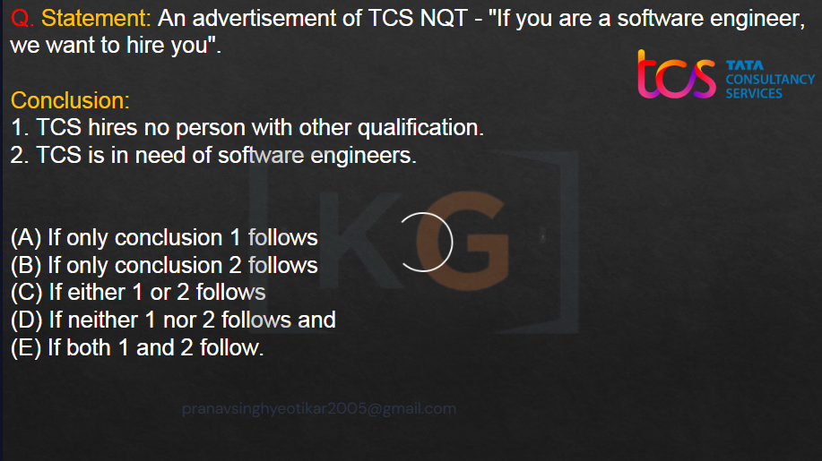
Here 
1) **If only conclusion1 follows**
   -> matlab only conclusion1 true
2) **If only conclusion2 follows**
   -> matlab only conclusion2 true
3) **If either 1 or 2 follows**
   -> matlab ek toh 1 ya 2, dono mein se koi ek sahi hai
4) **If neither 1 nor 2 follows**
   -> matlab ek toh 1 ya 2, dono mein se koi ek sahi **nahi** hai
5) **If both 1 or 2 follows**
   -> matlab dono true

### Imp Concepts
* **Statement is always true**
* **Conclusion** is something which is **100% true**
* **Conclusion** mein dimag nahi lagana, **joh hai woh man lena**
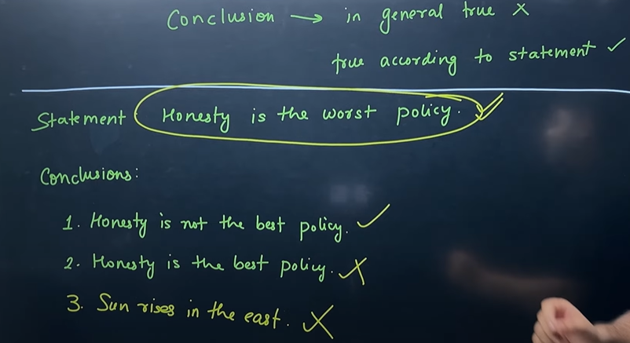
Here 
* *Sun rises in the east* is true, but no link with the statement, thats why **false**

> Inference == Conclusion

 

## Tips and Tricks
> **Conclusion must be general**, not specific

If it is specific then it can be false

#### 1) Do not make any assumption
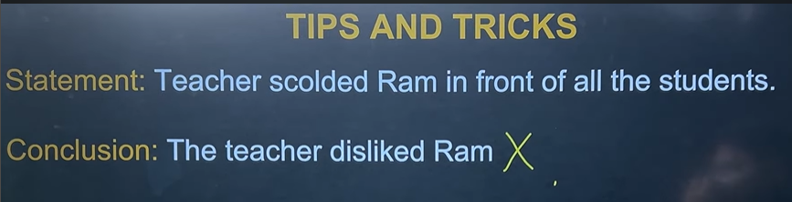
Here
Yaha aisa kahi nahi kaha ki, *teacher disliked ram*, so dont assume that teacher scolded so she will dislike
> **If it is mentioned** in statement **then only assume it**

#### 2) Advice or Result always True
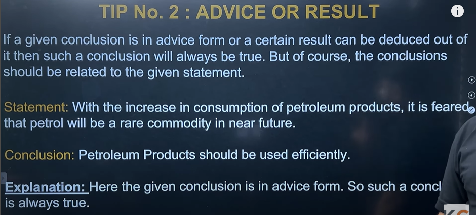
Here
Petroleum Products should be used efficiently. -> **advice**
So this **conclusion is true**
> If **advice** is given then it is **always true**

#### 3) Avoid Pre-assumptions
>**Baap kamjor** hai toh **beta strong nahi** ho sakta

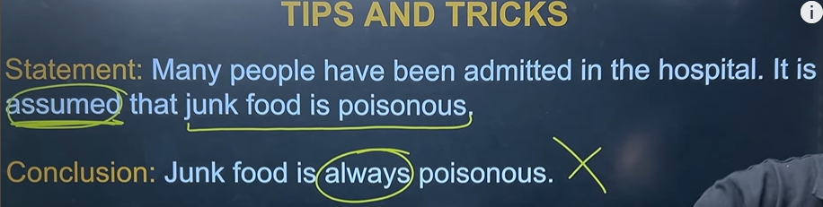
Here
* If statement is not sure, then conclusion must not be sure also
> If **statement is not sure**, **conclusion will always be unsure**

> If conclusion have these words
> **All, every, each, none, no-one, everyone, everybody, always**
> These **make conclusion false**, most of the time

>**Some, Many, Few, May , Might, May be**, make conclusion **true**

 

## IMP QUE
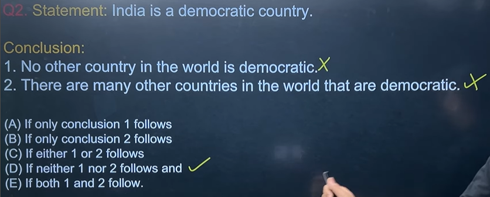
ex, no assumption or pre-assumption
we know only about india

#### either-or 
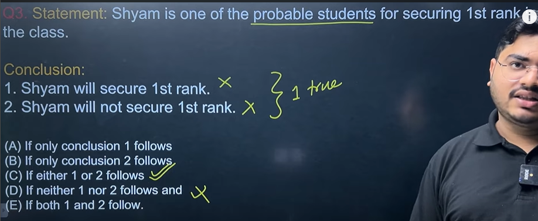
* yaha lag raha hai ki D) sahi hai, par ya toh woh first aayega ya toh nahi, both can be true, thats why option C)
* mostly occur when there is **yes/no** condition, **toggle** condition, **if this/ or that** condition

## First check
> 1) For strong words

> 2) Whether conclusion is talking about the same thing as statement

> 3) Check for [either-or](#either-or-1) thing

 
 

****

 
 

# **STATEMENT & ARGUEMENT**
- We will have been given a statement
- And some arguements based on that statement
- We have to tell **which arguement is strong or weak**

### Strong Arguements
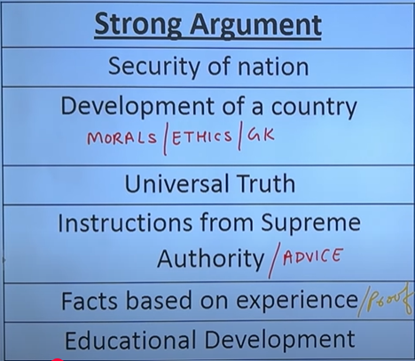
### Weak Arguements
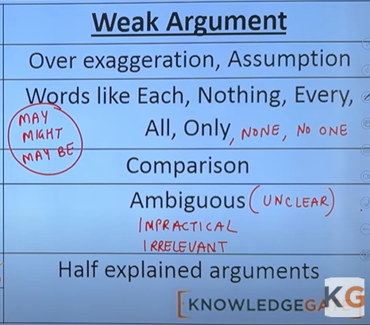

# Imp Que
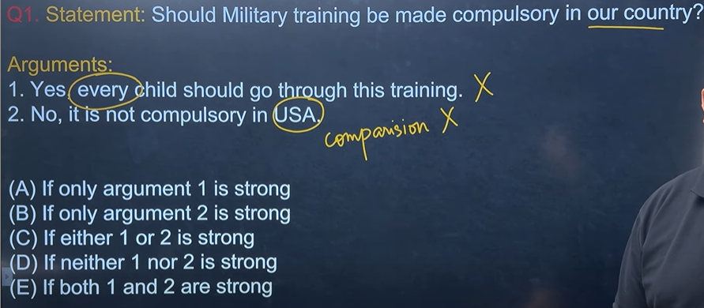
ex of **comparison** and **every** word

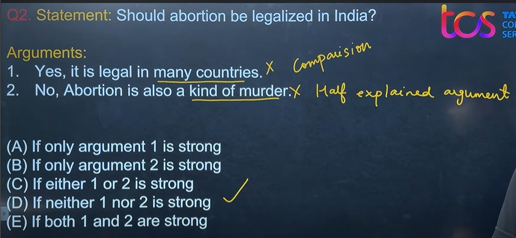
ex of **comparison** and **half explained** word

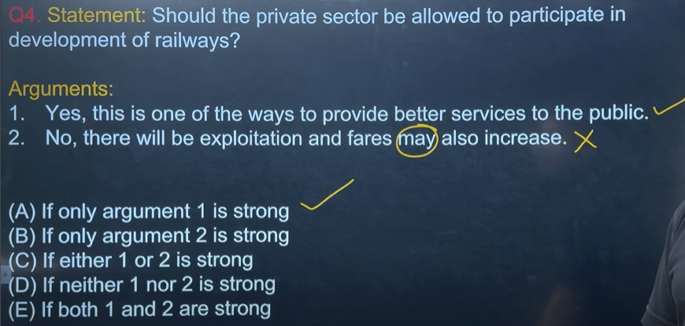
yaha mujhe confuse hua kyuki `"one of the ways"` likha hai, i thought it is a weak, because it is not confirm in itself, **but it is not like that**

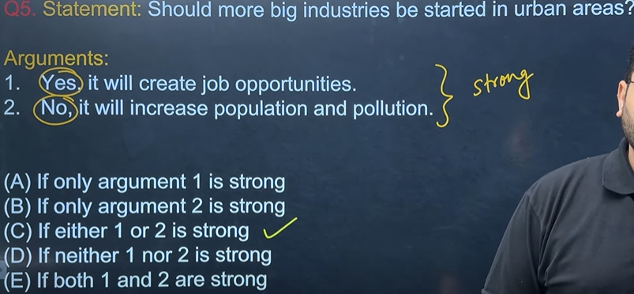
ex [either-or](#either-or-1)

ex [**both true**](#both-true)

 
 

****

 
 

# **STATEMENT & ASSUMPTION**
- We will have been given a statement
- And some assumption based on that statement
- We have to tell **which assumption is true or false**

 
 

****

 
 

# **STATEMENT & COURSE OF ACTION**
- We will have been given a statement
- And some actions based on that statement
- We have to tell **which actions is appropriate to take here**

 
 

****

 
 

# Special Conditions
# Either-Or
* mostly occur when there is **yes/no** condition, **toggle** condition, **if this/ or that** condition

# Both True
* mostly occur when there is **yes/yes** condition, **no/no** condition 