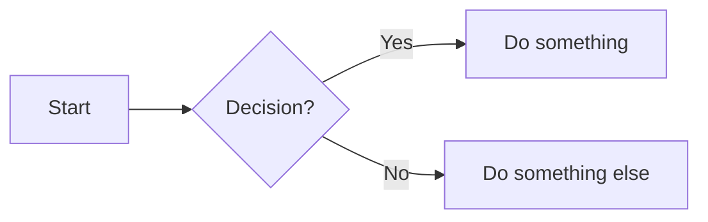

# 🌟 Markdown Playground — Ultimate README Style

Welcome to the **coolest** `.md` showcase ever.  
We’re going to flex links, images, diagrams, spoilers, and even some magic ✨

---

## 🔗 Links
[Google](https://www.google.com)  
[With Hover Text](https://www.google.com "Search Engine")  
[Link to section below](#-task-list)

---

## 🖼 Images
  

Clickable image:  
[](https://example.com)

---

## 💻 Code Blocks
```python
def greet():
    print("Hello, Markdown!")
greet()
```

---

## 📊 Table
| Name    | Power Level | Favorite Food |
|---------|-------------|---------------|
| Goku    | 9000+       | Ramen         |
| Naruto  | 8500        | Ichiraku      |

---

## ✅ Task List
- [x] Learn Markdown
- [x] Make a README that slaps 😎
- [ ] Rule the world 🌍

---

## 💬 Quote
> “Simplicity is the ultimate sophistication.” – Leonardo da Vinci

---

## 📂 Collapsible Section
<details>
<summary>Click to reveal spoiler 🤫</summary>
Naruto becomes Hokage.
</details>

---

## 🏷 Badges


---

## 📝 Footnotes
This sentence has a footnote.[^1]  
[^1]: This is the footnote text.

---

## 📖 Definition List
Markdown  
: A lightweight markup language.

README  
: A markdown file that tells people about your project.

---

## 📈 Mermaid Diagram


---

## 🎥 Embedded Video
<iframe width="560" height="315" src="https://www.youtube.com/embed/dQw4w9WgXcQ" 
title="YouTube video" frameborder="0" allowfullscreen></iframe>

---

## 🎨 Highlight + Keyboard Keys
Press <kbd>Ctrl</kbd> + <kbd>C</kbd> to copy.  
I <mark>love</mark> Markdown.

---

## 📊 Progress Bar
Progress: <progress value="70" max="100"></progress>

---
